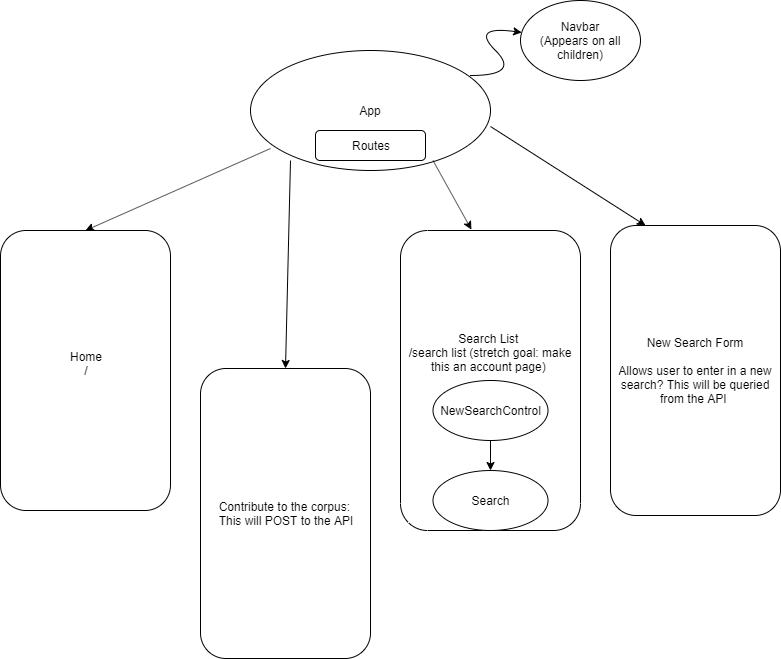

# _Corpus_

#### _The Capstone Project for Epicodus_

#### By _Anita Kemp_

## Description
This will be a way to gather language data that posts into an API. On the other side, one can search the database for patterns.

## User Stories

_As a researcher_:
    - I want the user to input summary based on a video (for now, to control variability)
    - I want the user to input language background 
    - I want the ability to query user input that has been stored in an API

_As a user_:
    - Users should be able to summarize what happened in video...

## Setup/Installation Requirements

## Support and contact details

_Please leave a comment on this repository if there are any questions._

## Technologies Used

### License

*MIT*

Copyright (c) 2019 **_Anita Kemp_**

## Component Diagram ##

There should also be a component that shows the list of contributions to the corpus (summaries only, no identifying detail)

## Refactor with redux to make the API Call Plan...
* _GET Summary list of already seeded data, add to Corpus Control
* _POST New summaries to API, update Corpus control with new list
* _SEARCH API, for tokens (by words first, or by language background?)
* _ADD Authentication 